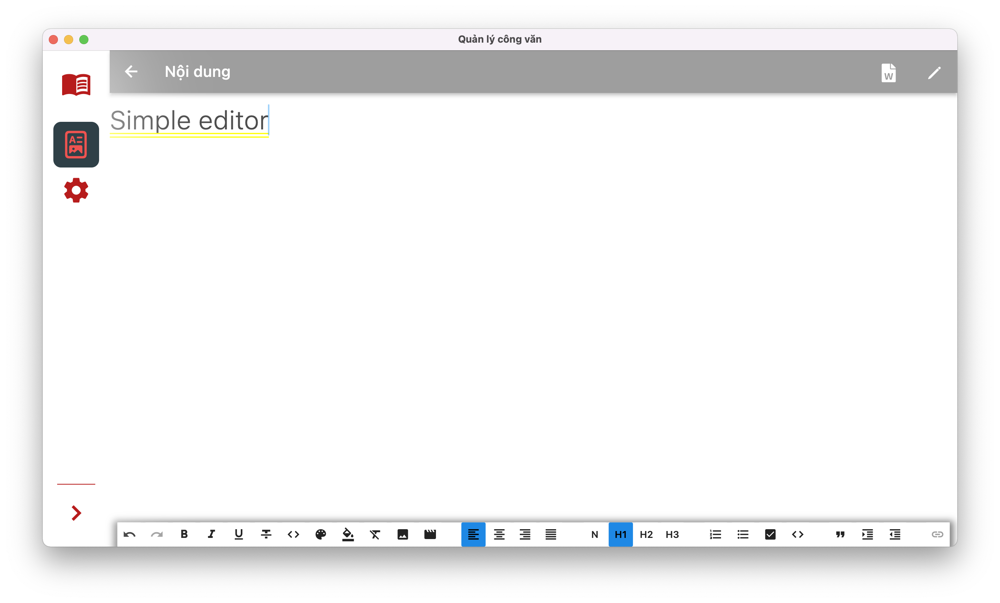

# Army Book Desktop App

a documents-organizing desktop app

## Screenshots

## Change Log
- see [change log](CHANGELOG.md)

## Plugins
- [Momentum](https://github.com/xamantra/momentum) (State management)
- [Sembast](https://github.com/tekartik/sembast.dart) (Database)
- [Bitsdojo Window](https://pub.dev/packages/bitsdojo_window) (Window Customization)

## Appreciation
- Star the repo if you like this piece of work
- Want to expand it per your needs, Fork the repo

## Made with Flutter 💙

### Ico ref
ico generated from [crello](https://crello.com/home/)
