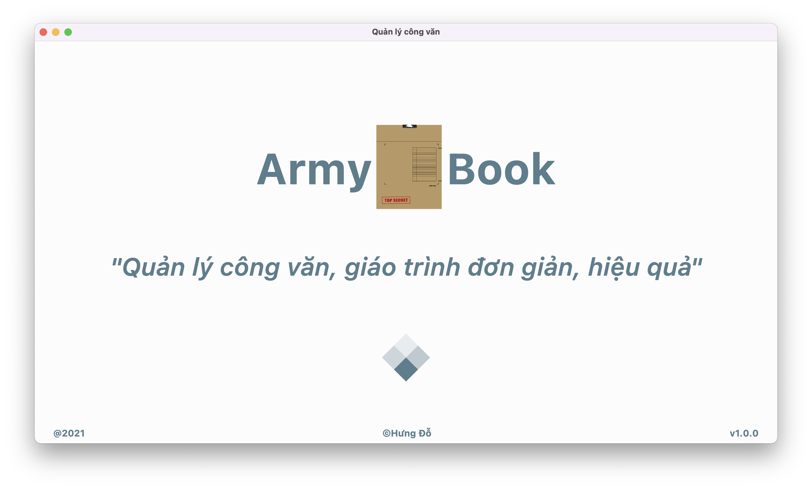
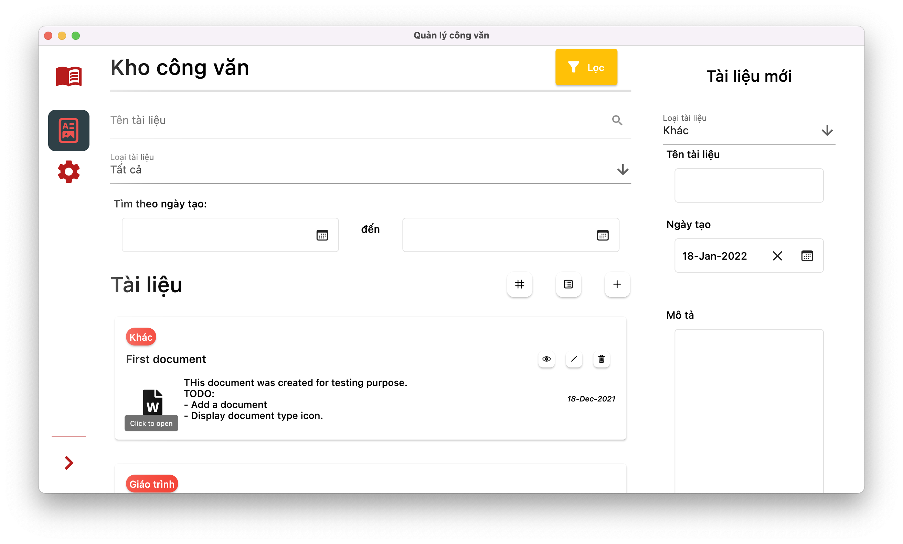

# Army Book Desktop App

Documents organizing desktop application.
Using local database by request for cheap and reliable internal usage.

## Screenshots

## Plugins
- [Momentum](https://github.com/xamantra/momentum) (State management)
- [Sembast](https://github.com/tekartik/sembast.dart) (Database)
- [Bitsdojo Window](https://pub.dev/packages/bitsdojo_window) (Window Customization)

## Made with Flutter 💙
